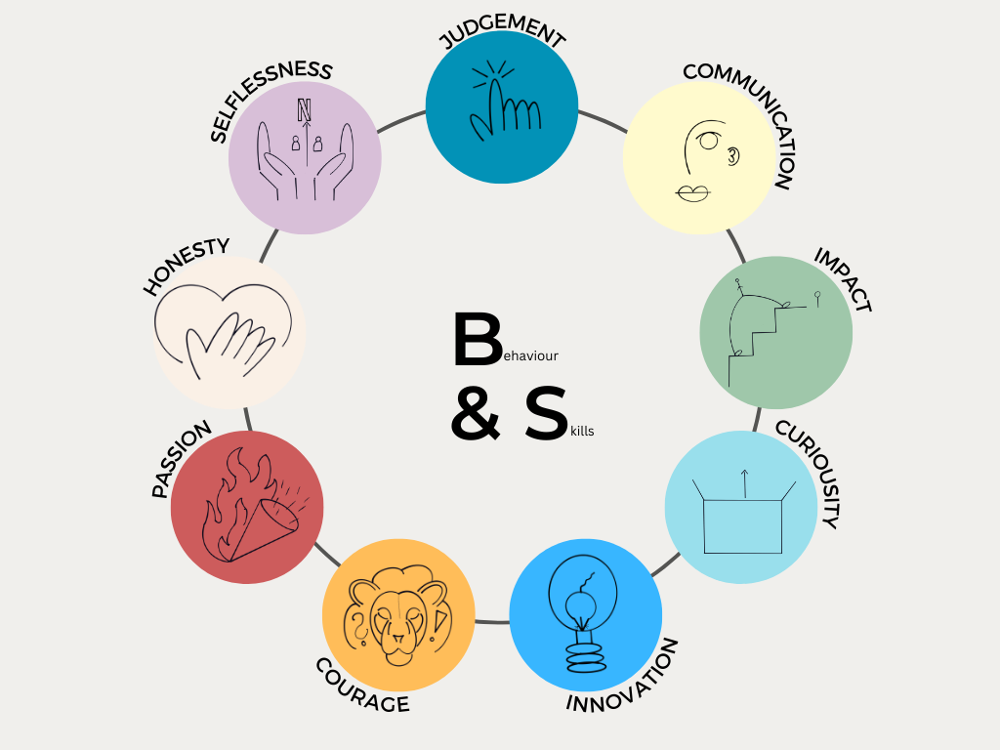

# Organizational Culture 

by Mara Nanni           - explained using the example of Netflix

---
To understand what the term means, it is helpful to first define the single concepts.

### Definition of Culture

"CULTURE IS HOW ORGANIZATIONS DO THINGS." - [Robbie Katanga](https://hbr.org/2013/05/what-is-organizational-culture)

Culture describes the overarching system of values and norms adopted by a group of people. It refers to the behavioral patterns in an organization that can be observed. Consequently, these behavior occur repeatedly.

### Definition of Organization

"A GROUP OF PEOPLE WHO WORK TOGETHER IN AN ORGANIZED WAY FOR A SHARED PURPOSE." - [Cambridge Dictionary](https://dictionary.cambridge.org/dictionary/english/organization)

An organization is a collaborative system existing for a specific period of time. With the help of personal or material task bearers e.g. people or machineries, tasks are carried out on behalf of the organization in fulfillment of the organization's goals.

### What is the definition of Organizational Culture?

Organizational culture is defined as a system of shared values and norms among members that differentiates the organization from other organizations. In the ideal case, the organizational culture is accepted and shared by every member of the organization. It is a result of interactions and usually reveals itself in common practices. An example for this can be, that every meeting within a company ends with collecting results and planing the next steps. Consequently, the organizational culture is based on unwritten rules of a social system, being expressed in all processes of the organization. The organizational culture makes the company unique; there is no other organization with the exact same culture. Since is it is subject to the interpretations of the individual, it is constantly changing.

---

## Why is Organizational Culture needed?

The five reasons for establishing an organizational culture:

1. increases the __stability__ of a social system
2. gives __orientation__ for correct behavior
3. sets the __boundaries__ to other organizations and their members
4. creates a sense of __identity__ for members
5. promotes the emergence of __commitment__

---

## How is to learn the organizational culture in the workplace?

The four ways culture is transmitted to employees:

*__Stories__*: Telling stories about significant events or people, such as a CEO speech or reactions to mistakes made, provides employees with information about what values and behaviors are desired in the organization. At the same time, it provides explanation for certain practices and illustrates what is of great relevance to the company. 

*__Rituals__*: Corporate rituals and ceremonies that highlight the achievements of an individual or a team, for example, make it clear who is of particularly high relevance to the company. Another example would be that every employee is given a little present for his or her birthday. This form of appreciation reflects the culture of the organization. 

*__Symbols__*: The use of material symbols gives employees within an organization information about how the hierarchical structure prevails in the company and what behaviors are expected. If the CEO sits in the same office as the other employees, it indicates an organization with flat structures. However, if the CEO has his office several floors higher than his employees, there are strict hierarchies in the company. 

*__Language__*: The use of language also allows conclusions to be drawn about organizational culture. If an employee is familiar with the common abbreviations or terms used daily in the company, he or she is familiar with the culture of the organization.

---

## Cultural Fit

## Business Case: Organizational Culture using the Example of Netflix

They developed the [Culture Code](https://www.slideshare.net/reed2001/culture-1798664).

    "OUR CULTURE FOCUSES ON HELPING US ACHIEVE EXCELLENCE." - Netflix, 2009

According to [Netflix](https://www.youtube.com/watch?v=7O87hhyLa9U), considering seven aspects of culture is key to a successful organization.

#### 1. Values are what we Value

According to Netflix, the values of a company are reflected in the behaviors and skills which are valued by the employees. In this context, there are nine values that are considered particularly desirable and worthy of promotion. In contrast, Netflix lets go of those people who don't represent the values. The business appreciates people with good __1)__ __judgement__ skills. This includes being able to take decisions wisely, even if the information available is ambiguous as well as thinking strategically. Employees who have this capability are also skilled at prioritizing tasks effectively. In addition, __2)__ __communication__ is considered as an relevant value. Those people listen and evaluate carefully instead of making rash statements. They face people with respect and are capable of keeping calm, even in stressful situations. Employees proofing __3)__ __impact__ are characterized by working goal-oriented and constantly performing high. Beyond that, Netflix requires their employees to continuously appear with __4)__ __curiosity__, which includes to see things from stakeholders' perspective, regularly extend one's knowledge about business, technology and entertainment as well as conduct tasks not included in your specialty. Valuing __5)__ __innovation__ implies that an employee challenges existing assumptions while finding solutions to them and new problems. Innovation also involves minimizing complexity and simplifying content. Beyond that, Netflix seeks for employees who continuously unveil __6)__ __courage__. This includes expressing controversial opinions as well as taking complex decisions. Netflix looks for people who inspire others by their top performance and highly care about the company's success, in other words: employees need __7)__ __passion__. As with many other companies, __8)__ __honesty__ is one of Netflix's fundamental corporate values. This implies that employees communicate in an open, direct and non-judgmental way and openly admit mistakes made, in addition being willing to admit mistakes. According to Netflix, an employee reflects __9)__ __selflessness__ when always choosing the option that is best for the company, putting own needs or the needs of the team second. Selfless employees invest their time in helping colleagues and sharing their knowledge with them.

#### 2. High Performance

   "GREAT WORKPLACE IS STUNNING COLLEAGUES" 

According to Netflix, a high performance culture creates the foundation for effective working. 

#### 3. Freedom & Responsibility

##### The Rare Responsible Person

Netflix states that "The Rare Responsible Person" is someone who thrives of freedom, simultaneously also being worth it. In detail, this implies that an employee has the following characteristics:

* Self motivating
* Self aware 
* Self discipline
* Self improving
* Acts like a leader
* Doesn't wait to be told what to do
* Picks up the trash lying on the floor

 

This idea is deeply embedded in Netflix's corporate culture. It is believed that business success is only possible when employees are given freedom and responsibility. This encourages and attracts innovative employees, which in turn has a positive impact on the company's success. 

#### 4. Context, not Control

To become a successful organization, leaders should create an appropriate context as a foundation for desired outcomes. It is assumed that control over employees does not lead to the success of a company. Rather, they should receive internal information so that they can understand decisions made. In this context, Netflix defines exactly which context-enhancing behaviors lead to the desired outcome and which controlling activities should be avoided.

| Context (embrace)                             | Control (avoid)                               |
| ----------------------------------------------| ----------------------------------------------|
| Strategy                                      | Top-down decision-making                      |
| Metrics                                       | Management approval                           |      
| Assumptions                                   | Committees                                    |
| Metrics                                       | Planning and process valued more than results |     
| Objectives                                    |                                               |       
| Clearly-defined roles                         |                                               |    
| Knowledge of the stakes                       |                                               |    
| Transparency around decision-making           |                                               | 

#### 5. Highly Aligned, Loosely Coupled

| Highly Aligned Goals                                                                |
| ------------------------------------------------------------------------------------|
| - clearly-defined, specific and broad understood goals and strategy                 |
| - team interactions are oriented towards strategy and goals                         |
| - transparency and perceptiveness require noticeable amount of management time      |

#### 6. Pay Top of Market

#### 7. Promotions & Development

---

---
References:

Harvard Business Review. (2014, August 7). *What is organizational culture? and why should we care?* https://hbr.org/2013/05/what-is-organizational-culture.

Robbins, S. P., & Judge, T. (2022). Organizational behavior. Pearson Education Limited. 

[def]: 4.png