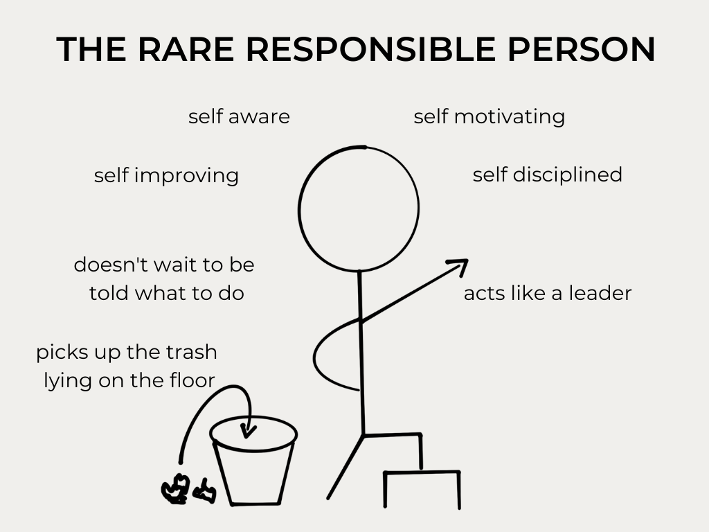

# Organizational Culture 

This blog post was created by Mara Nanni as part of the course *Digital* *Organization,* *Automation* *&* *Technology* with Prof. Dr. Ulrich Anders. The focus is on the topic of __Organizational__ __Culture__, which is explained in detail using the example of the company *Netflix*. 

---

## What is the definition of Organizational Culture?

To understand what the term means, it is helpful to first define the single concepts.

---

### Definition of Culture

"CULTURE IS HOW ORGANIZATIONS DO THINGS." - [Robbie Katanga](https://hbr.org/2013/05/what-is-organizational-culture)

Culture describes the overarching system of values and norms adopted by a group of people. It refers to the behavioral patterns in an organization that can be observed. Consequently, these behavior occur repeatedly.

---

### Definition of Organization

"A GROUP OF PEOPLE WHO WORK TOGETHER IN AN ORGANIZED WAY FOR A SHARED PURPOSE." - [Cambridge Dictionary](https://dictionary.cambridge.org/dictionary/english/organization)

An organization is a collaborative system existing for a specific period of time. With the help of personal or material task bearers, such as people or machineries, tasks are carried out on behalf of the organization in fulfillment of the organization's goals.

---

### Definition of Organizational Culture

Organizational culture is defined as a system of __shared__ __values__ and __norms__ among members that differentiates the organization from other organizations. In the ideal case, the organizational culture is accepted and shared by every member of the organization. It is a result of interactions and usually __reveals__ __itself__ __in__ __common__ __practices__. An example for this can be, that every meeting within a company ends with collecting results and planing the next steps. Consequently, the organizational culture is based on unwritten rules of a social system, being expressed in all processes of the organization. The organizational culture __makes__ __the__ __company__ __unique__; there is no other organization with the exact same culture. Since is it is subject to the interpretations of the individual, it is __constantly__ __changing__.

---

## Why is Organizational Culture needed?

The five reasons for establishing an organizational culture:

:balance_scale: 1. increases the __stability__ of a social system

🧭 2. gives __orientation__ for correct behavior

:ng_woman: 3. sets the __boundaries__ to other organizations and their members

:id: 4. creates a sense of __identity__ for members

:handshake: 5. promotes the emergence of __commitment__

---

## How is to learn the organizational culture in the workplace?

The four ways culture is transmitted to employees:

:book: *__Stories__*: Telling stories about significant events or people, such as a CEO speech or reactions to mistakes made, provides employees with information about what values and behaviors are desired in the organization. At the same time, it provides explanation for certain practices and illustrates what is of great relevance to the company. 

:gift: *__Rituals__*: Corporate rituals and ceremonies that highlight the achievements of an individual or a team, for example, make it clear who is of particularly high relevance to the company. Another example would be that every employee is given a little present for his or her birthday. This form of appreciation reflects the culture of the organization. 

:symbols: *__Symbols__*: The use of material symbols gives employees within an organization information about how the hierarchical structure prevails in the company and what behaviors are expected. If the CEO sits in the same office as the other employees, it indicates an organization with flat structures. However, if the CEO has his office several floors higher than his employees, there are strict hierarchies in the company. 

:speaking_head: *__Language__*: The use of language also allows conclusions to be drawn about organizational culture. If an employee is familiar with the common abbreviations or terms used daily in the company, he or she is familiar with the culture of the organization.

---

## Business Case: Organizational Culture using the Example of Netflix

    "OUR CULTURE FOCUSES ON HELPING US ACHIEVE EXCELLENCE." - Netflix, 2009

Therefore, Netflix developed the [Culture Code](https://www.slideshare.net/reed2001/culture-1798664), assuming it is the key to achieve the long-term goal. In detail, [Netflix](https://www.youtube.com/watch?v=7O87hhyLa9U) considers seven aspects of culture to be crucial to organizational growth. 

---

### 1. Values are what we Value

According to Netflix, the values of a company are reflected in the behaviors and skills which are valued by the employees. In this context, there are nine values that are considered particularly desirable and worthy of promotion. In contrast, Netflix lets go of those people who don't represent the values. The business appreciates people with good __1)__ __judgement__ skills. This includes being able to take decisions wisely, even if the information available is ambiguous as well as thinking strategically. Employees who have this capability are also skilled at prioritizing tasks effectively. In addition, __2)__ __communication__ is considered as an relevant value. Those people listen and evaluate carefully instead of making rash statements. They face people with respect and are capable of keeping calm, even in stressful situations. Employees proofing __3)__ __impact__ are characterized by working goal-oriented and constantly performing high. Beyond that, Netflix requires their employees to continuously appear with __4)__ __curiosity__, which includes to see things from stakeholders' perspective, regularly extend one's knowledge about business, technology and entertainment as well as conduct tasks not included in your specialty. Valuing __5)__ __innovation__ implies that an employee challenges existing assumptions while finding solutions to them and new problems. Innovation also involves minimizing complexity and simplifying content. Beyond that, Netflix seeks for employees who continuously unveil __6)__ __courage__. This includes expressing controversial opinions as well as taking complex decisions. Netflix looks for people who inspire others by their top performance and highly care about the company's success, in other words: employees need __7)__ __passion__. As with many other companies, __8)__ __honesty__ is one of Netflix's fundamental corporate values. This implies that employees communicate in an open, direct and non-judgmental way and openly admit mistakes made, in addition being willing to admit mistakes. According to Netflix, an employee reflects __9)__ __selflessness__ when always choosing the option that is best for the company, putting own needs or the needs of the team second. Selfless employees invest their time in helping colleagues and sharing their knowledge with them.

---

### 2. High Performance

    "GREAT WORKPLACE IS STUNNING COLLEAGUES." - Netflix, 2009 

Netflix states that a high performance culture creates the foundation for effective working. This implies that Netflix executives are selectively hiring, developing, or letting employees go in order to ensure that every position is filled by talent. In addition, it is important to Netflix to *communicate* *honestly* about which employee is of particular relevance to the company or a team. 
Moreover, Netflix's organizational culture is aligned towards fostering the corporate team. Unlike a sports team, where the number of positions is limited, Netflix aims for an increasing number of talents. Employees are encouraged not to compete against each other, but to *support* *each* *other* in achieving high performance. Just like on a sports team, the priority of every talent at Netflix should be to *perform* *at* *a* *high* *level*, regardless of how long the member belongs to the teams.

A preferred method to grant high performance in the company is the *Keeper* *Test*. Netflix's leaders ask themselves if they would try hard to keep an employee who wants to leave the company from quitting. If not, this is an indicator that the employee should leave the company and that a replacement will contribute to higher performance.

Netflix believes loyalty has a stabilizing influence and thus contributes to achieving high performance in the company. Embedded in the culture is the belief that in the short term, both the company and employees should experience *loyalty* in the event of a setback or decline in performance. However, long-term loyalty to a mid-level employee or a stagnant company does not lead to the desired high performance.  

----

### 3. Freedom & Responsibility

One aspect of Netflix's organizational culture, is the image of __The__ __Rare__ __Responsible__ __Person__ being someone who *thrives* of freedom, simultaneously also being *worth* it. In detail, this implies that an employee has the following characteristics:

* Self motivating
* Self aware 
* Self discipline
* Self improving
* Acts like a leader
* Doesn't wait to be told what to do
* Picks up the trash lying on the floor

 

Ingrained in Netflix's corporate culture is the firm belief that managers should avoid controlling their employees. It is assumed that entrepreneurial success can only be achieved if employees are given freedom and responsibility. This aspect of the corporate culture encourages and attracts innovative employees, which in turn has a positive impact on the success and growth of the business.
Growing companies in particular make the mistake of limiting employees' freedom due to increasing complexity over time, explains Netflix. In order to counteract the resulting chaos, rules and predefined patterns of action are established. As a result, the creativity of the company's talents is restricted, reducing the overall level of high-performance employees in the company.
However, to prevent this, Netflix is always striving to ensure that the talent density in the company rises higher than the complexity increases. 

Freedom and responsibility are deeply embedded in Netflix's corporate culture, which is also evident from its vacation policy. Employees do not have a 9am to 5pm workday and no working hours are tracked in the company. Thus, employees may work late into the night, check emails on the weekend, but also spend their afternoon on personal time. Likewise, the company does not see the need for a strict vacation policy. The focus is not on the number of vacation days an employees take, but whether they complete their tasks. Nor does the company impose a dress code on employees as long as they come to work wearing clothes.
Nevertheless, freedom is not unlimited at Netflix. Dishonesty and harassment are not tolerated in the workplace. In addition, the company takes legal issues very seriously and always controls the secure handling of customers' payment information.

---

### 4. Context, not Control

To become a successful organization, leaders should create an appropriate context as a foundation for desired outcomes. It is assumed that control over employees does not lead to the success of a company. Rather, they should receive internal information so that they are enabled to understand decisions made. In this context, Netflix defines exactly which context-enhancing behaviors lead to the desired outcome and which controlling activities should be avoided.

| Context (embrace)                             | Control (avoid)                               |
| ----------------------------------------------| ----------------------------------------------|
| Strategy                                      | Top-down decision-making                      |
| Metrics                                       | Management approval                           |      
| Assumptions                                   | Committees                                    |
| Objectives                                    | Planning and process valued more than results |     
| Clearly-defined roles                         |                                               |       
| Knowledge of the stakes                       |                                               |    
| Transparency around decision-making           |                                               |    

The methods listed in the table enable employees to act independently in the best interest of the organization because they are aware of the context. It is necessary for employees to be able to establish a link between their activities and the corporate and functional goals with the help of basic assumptions and the corporate strategy. Transparency regarding the decision-making process provides information regarding the relative priority of activities. They can distinguish between tasks that are critical and "nice to have" tasks.Furthermore, good context provides information about the level of precision & refinement required. Employees recognize the tasks where they cannot allow themselves to make mistakes, where mistakes can be corrected afterwards, and which tasks can be performed roughly. It is critical for employees to be aware of key stakeholders, key metrics and the company's definition of success in order to be able to make decisions in Netflix's best interest.

Netflix believes that a clearly communicated corporate context empowers high-performing employees to work efficiently and make the correct decisions for the company. However, if an employee makes a significant mistake, the underlying cause lies in the fact that the employee was not sufficiently informed about the context. When this happens, it is the responsibility of managers to contribute to a greater understanding of the context through regular departmental meetings and open communication of strategies and goals. 

However, Netflix acknowledges that there are exceptions to "Context, no Control." For instance when a new employee is hired who still needs to learn about the context, control by the manager is highly needed. In addition, temporary control of the manager may be necessary when a position is held by a person who does not operate in the best interests of the company.

---

### 5. Highly Aligned, Loosely Coupled

The way that teams work is described as __Highly__ __Aligned,__ __Loosely__ __Coupled__. The model of corporate teamwork is profoundly embedded in Netflix' organizational culture and assumes, that the effectiveness of a team is build on high performance people and a good context. The __highly__ __aligned__ __aspects__ of this agile work method involves team collaboration focused on executing clear and concise goals and strategies. Simultaneously, transparency and perceptiveness require high time investment in management. On the other hand, __loosely__ __coupled__ implies, that the number of meetings is reduced to a minimum, but they are held only occasionally for the purpose of jointly coordinating corporate goals and strategies. A basic trust between the teams enables teams to make decisions quickly and independently. 

---

### 6. Pay Top of Market

The Salaries at Netflix are a critical part of the organizational culture. The corporation is willing to wisely invest in employees' salaries, assuming that a few high performance employees would achieve more than numerous average employees.

An employee's salary should fulfill the following:
1. It should be higher than the salary any other employer would pay the same person.
2. It should be equal to what it would cost to hire a replacement.
3. It should be equal to what Netflix would pay to keep the person from leaving the company because of a higher offer.

Even after hiring, Netflix adjusts the compensation of high-performing employees annually in accordance with the market.

Following this principle, an employee's compensation increases are based on increasing demand their area of expertise or because he or she is increasingly gaining skills. Here Netflix emphasizes that it may happen that the compensation of some employees does not change for several years due to market conditions; however, the person should always be at the top of the market. Similarly, compensation is not dependent on Netflix's failure or success. While employees can leave the company at any time, market-driven pay and passion at work ensure that hardly anyone wants to leave. Finally, Netflix avoids rankings against other employees. Instead of competing among each other, employees should be encouraged to support their colleagues.  

---

### 7. Promotions & Development

Furthermore, Netflix clearly communicates what promotion and development opportunities the company offers. In case an employee wants to leave the company, a manager should allow the employee to be promoted if the following criteria are met:

:chart_with_upwards_trend: 1. If an employee is good performing in her position, a higher position should only be offered to her, her job is big enough and her filling the new position is beneficial for the company.

:star: 2. The person would apply for the higher position at Netflix or another company and get it because their skills meet the requirements; in other words, the person is superstar in their current role.

:superhero_woman: 3. In addition, promotion requires that the employee live out Netflix's culture and values and represent them within the company. 

Furthermore, it is part of Netflix's corporate culture that employees drive their career development independently rather than following a strict career plan as is typical in other large companies. Rather, employees are given the change to continuously improve themselves through experience, observation, introspection, reading, and discussion. Similarly, working with talented colleagues and overcoming major challenges contributes to the continuous development of the individual. According to Netflix, these measures positively impact an individual's skills and reputation, which in turn promotes his or her economic security

---
---
References:

Company culture is everyone's responsibility. Harvard Business Review. (2021, February 9). Retrieved November 12, 2022, from https://hbr.org/2021/02/company-culture-is-everyones-responsibility.

Harvard Business Review. (2014, August 7). *What is organizational culture? and why should we care?* https://hbr.org/2013/05/what-is-organizational-culture.

Hastings, R. (2020). No rules rules: Netflix and the culture reinvention. WH Allen.

McCord, P. (2014). How netflix reinvented HR. Harvard Business Review, 92(1), 71-76.

Netflix Culture — Seeking Excellence. Netflix jobs. (n.d.). Retrieved November 12, 2022, from https://jobs.netflix.com/culture.

Robbins, S. P., & Judge, T. (2022). Organizational behavior. Pearson Education Limited. 

Schein, E. H. (1990). Organizational culture. American Psychologist, 45(2), 109–119. https://doi.org/10.1037/0003-066x.45.2.109.

