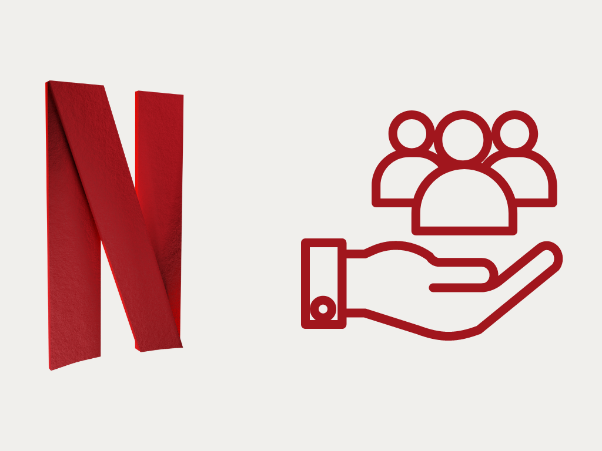
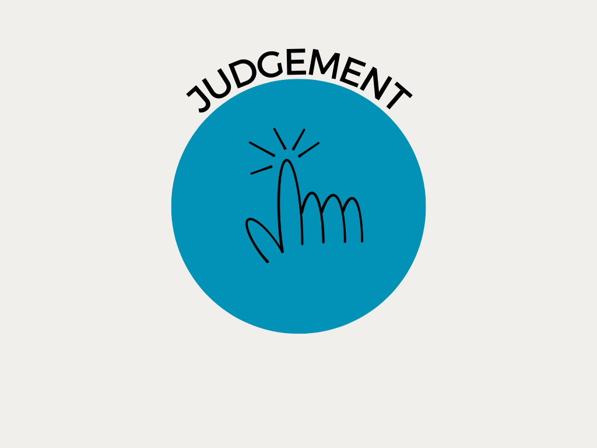
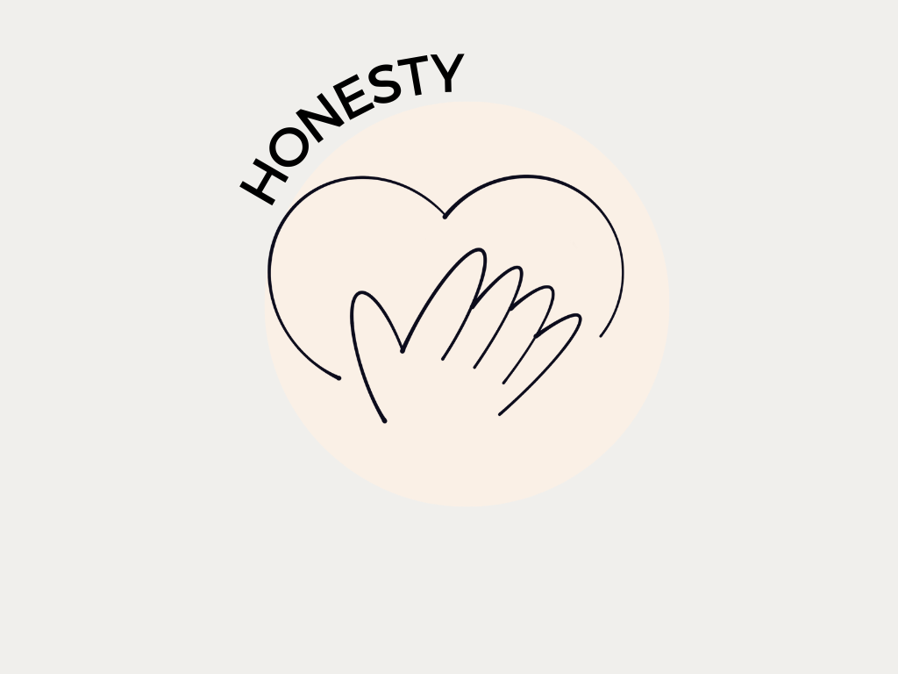
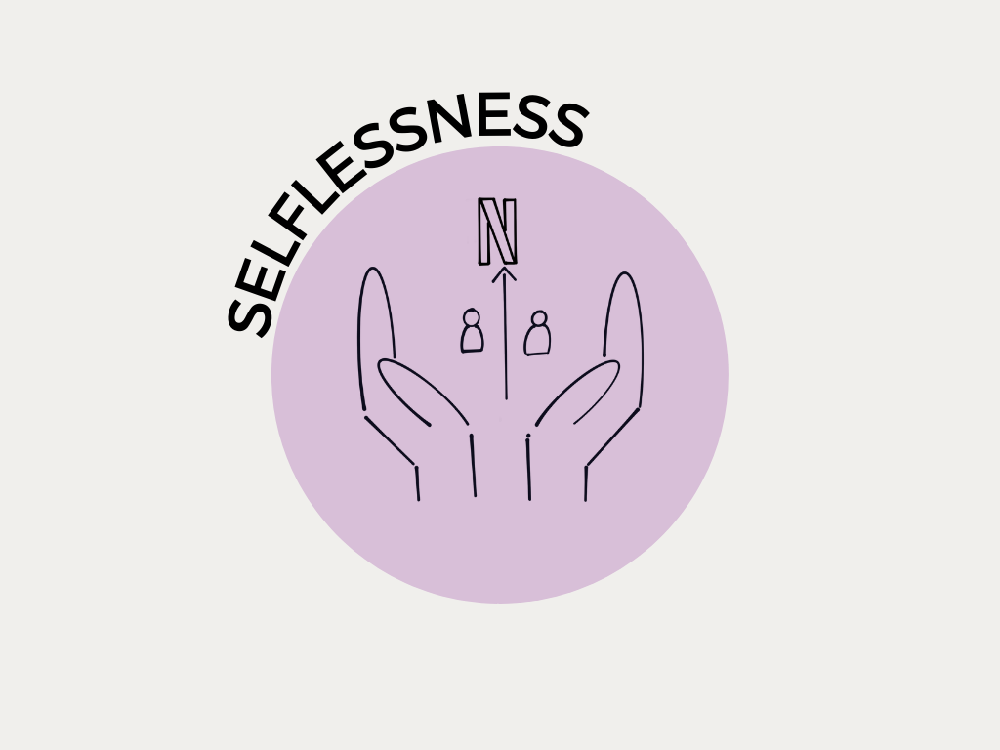
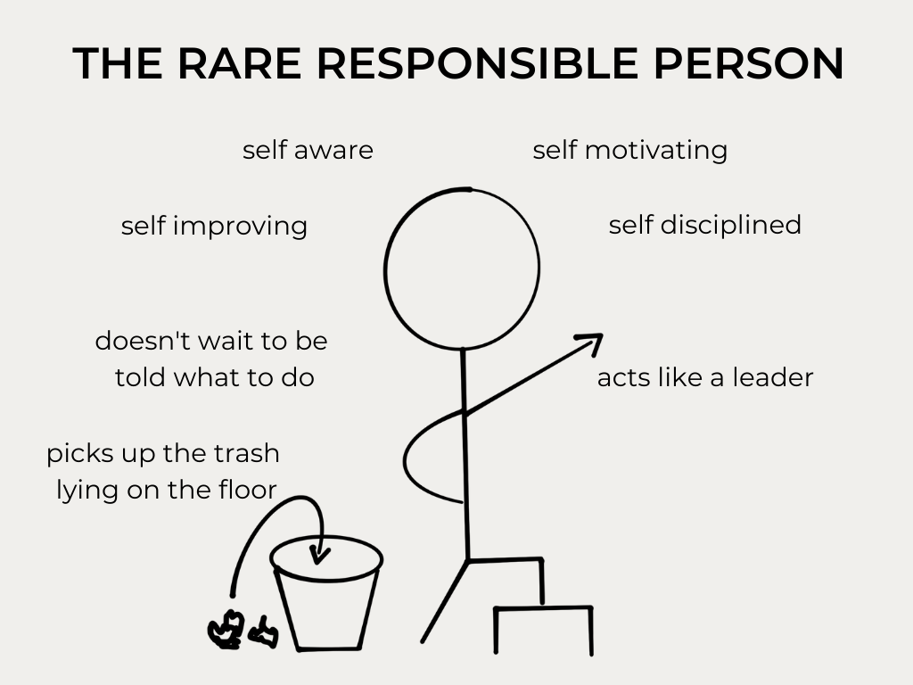
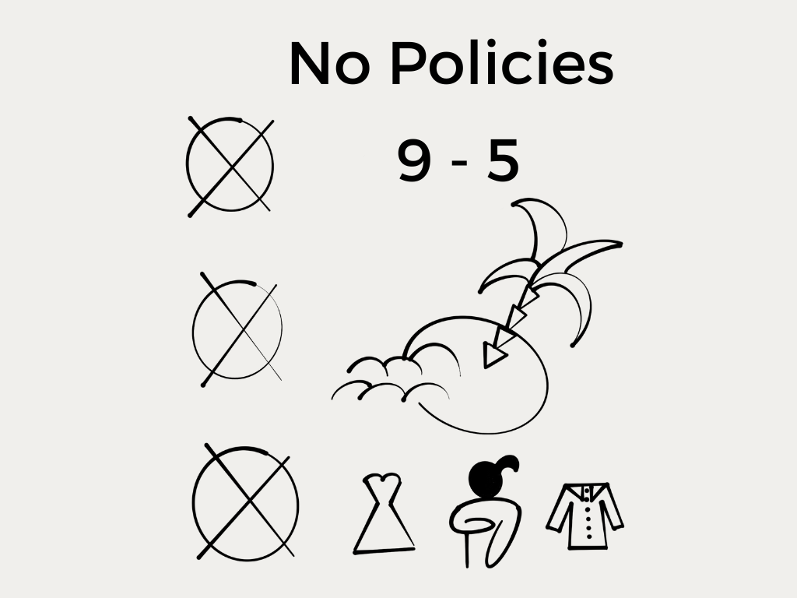
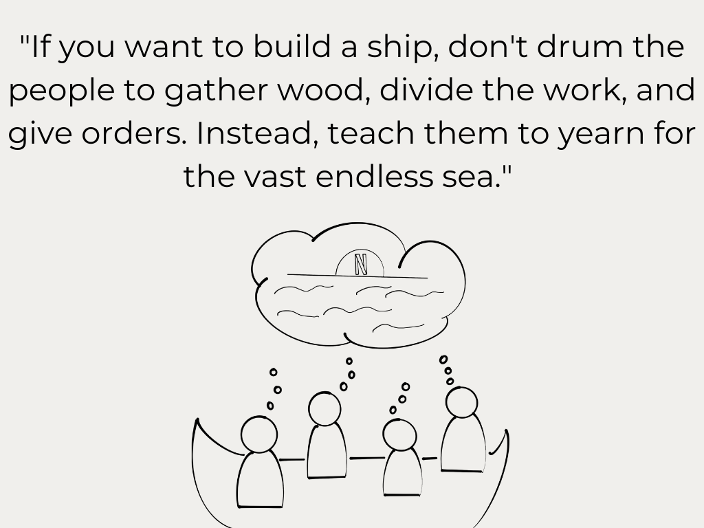
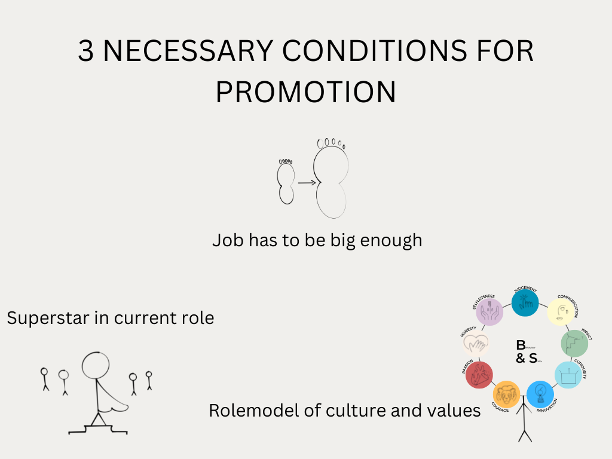

# Organizational Culture 

Digital Organization, Automation & Technology 

Prof. Dr. Ulrich Anders | November 15, 2022

Mara Nanni

----

## Today's Agenda:
1. Definition Organizational Culture
2. Reasons for Organizational Culture
3. Implementation of Organizational Culture
4. Business Case: Organizational Culture of Netflix
5. Three Main Takeaways from the Presentation

----

## What is the definition of Organizational Culture?

----

### Definition of Culture

> "CULTURE IS HOW ORGANIZATIONS DO THINGS." 
>
>  ##### [Robbie Katanga](https://hbr.org/2013/05/what-is-organizational-culture)

----

### Definition of Organization

> "A GROUP OF PEOPLE WHO WORK TOGETHER IN AN ORGANIZED WAY FOR A SHARED PURPOSE." 
>
> ###### [Cambridge Dictionary](https://dictionary.cambridge.org/dictionary/english/organization)

----

### Definition of Organizational Culture

Organizational culture is defined as a system of __shared__ __values__ and __norms__ among members that differentiates the organization from other organizations.

----

## Why is Organizational Culture needed?

----

Reasons for establishing an Organizational Culture:

1. stability ⚖️

2. orientation 🧭 

3.  boundaries 🚧

4. identity 🆔

5. commitment 🤝

----

## How is to learn the organizational culture in the workplace?

---

Culture is transmitted to employees through:

__1.__ __Stories__ 📚

__2.__ __Rituals__ 🎁

__3.__ __Symbols__ 🔣

__4.__ __Language__ 🗣️

----

## Business Case: Organizational Culture using the Example of Netflix

----

----

> "OUR CULTURE FOCUSES ON HELPING US ACHIEVE EXCELLENCE."
>
> ##### Netflix, 2009

----

[Culture Code](https://www.slideshare.net/reed2001/culture-1798664) developed by Netflix considers 7️⃣ aspects of culture to be crucial to organizational growth

---

## 1️⃣ VALUES IS WHAT WE VALUE

---

A company's values are reflected in nine desireable behaviors and skills of employees.

---

----

----

----

----

----

----

----

-----

----

## 2️⃣ High Performance

---

> "GREAT WORKPLACE IS STUNNING COLLEAGUES." 
>
> ##### Netflix, 2009 

----

* Netflix as a pro sports team 🤜🤛

* apply the Keeper Test 🔍

* loyalty as stabilizer ⚓

----

## 3️⃣ Freedom & Responsibility

----

----

----

## 4️⃣ Context, no Control

----

---

| __Context__ __(embrace)__                     |                                
| ----------------------------------------------| 
| Strategy                                      | 
| Metrics                                       |     
| Assumptions                                   | 
| Objectives                                    |    
| Clearly-defined roles                         |                                                   
| Knowledge of the stakes                       |                                                 
| Transparency around decision-making           | 

----

| __Control__ __(avoid)__                       |
| ----------------------------------------------| 
| Top-down decision-making                      | 
| Management approval                           |     
| Committees                                    | 
| Planning and process valued more than results |  

----

## 5️⃣ Highly Aligned, Loosely Coupled

----

----

## 6️⃣ Pay Top of the Market

----

## 7️⃣ Promotion & Development

----

----

----

-  Company culture is everyone's responsibility. Harvard Business Review. (2021, February 9). Retrieved November 12, 2022, from https://hbr.org/2021/02/company-culture-is-everyones-responsibility.

- Harvard Business Review. (2014, August 7). *What is organizational culture? and why should we care?* https://hbr.org/2013/05/what-is-organizational-culture.

- Hastings, R. (2020). No rules rules: Netflix and the culture reinvention. WH Allen.

----

- McCord, P. (2014). How netflix reinvented HR. Harvard Business Review, 92(1), 71-76.

- Netflix Culture — Seeking Excellence. Netflix jobs. (n.d.). Retrieved November 12, 2022, from https://jobs.netflix.com/culture.

- Robbins, S. P., & Judge, T. (2022). Organizational behavior. Pearson Education Limited. 

- Schein, E. H. (1990). Organizational culture. American Psychologist, 45(2), 109–119. https://doi.org/10.1037/0003-066x.45.2.109.

