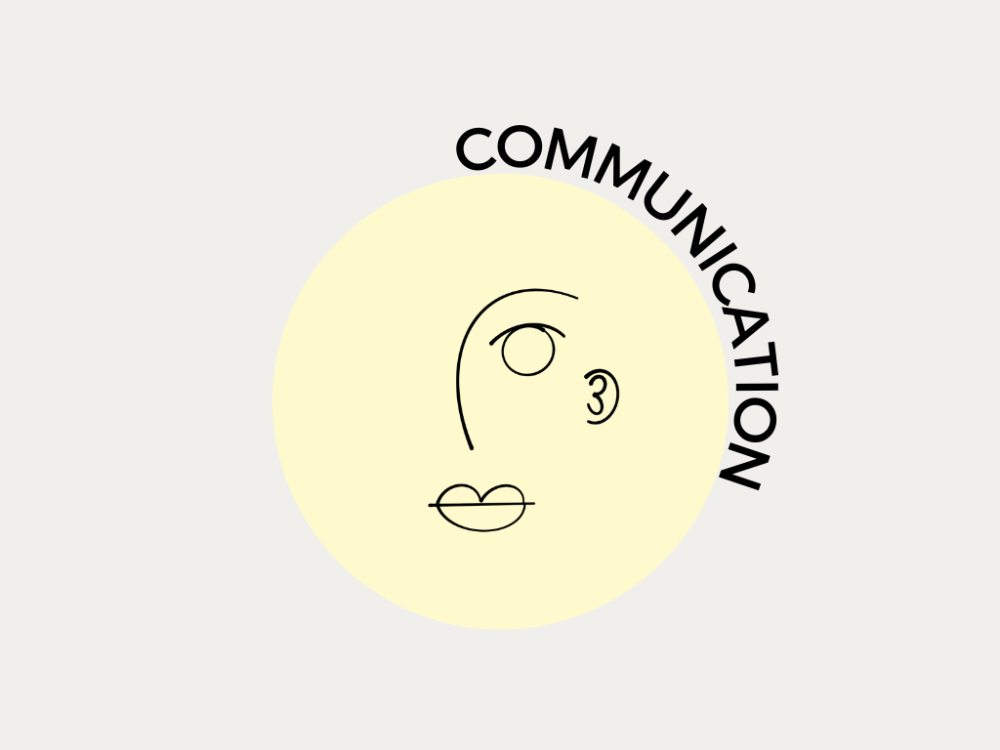
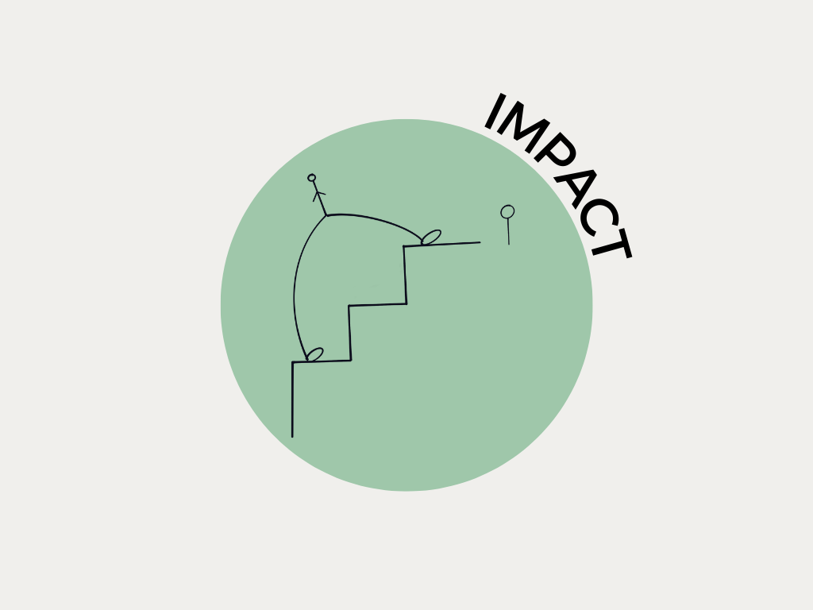
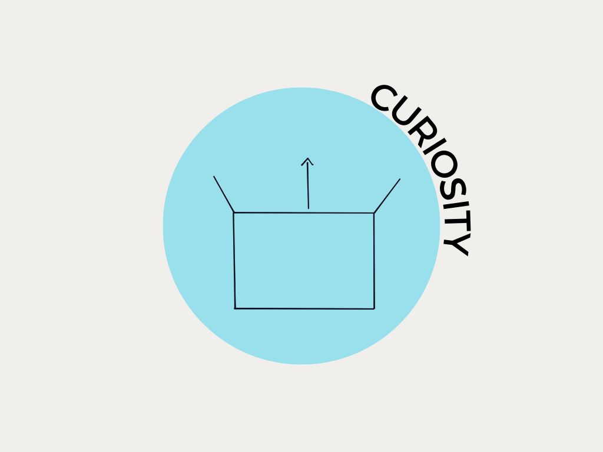
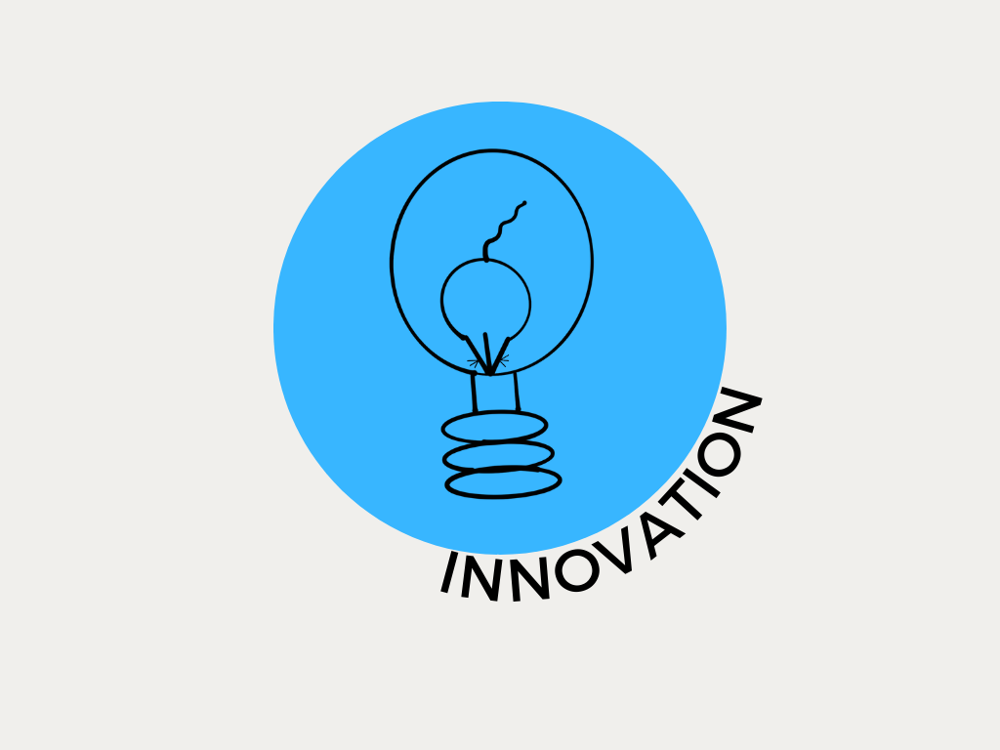
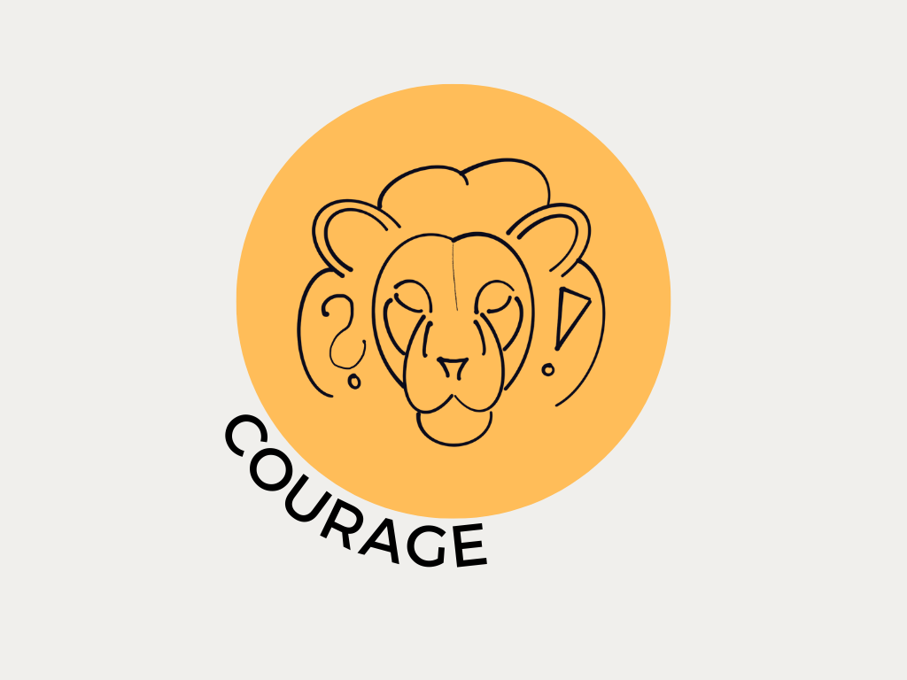

# Organizational Culture 

----

## Today's Agenda:
1. Definition Organizational Culture
2. Reasons for Organizational Culture
3. Implementation of Organizational Culture
4. Business Case: Organizational Culture of Netflix

----

## What is the definition of Organizational Culture?

----

### Definition of Culture

> "CULTURE IS HOW ORGANIZATIONS DO THINGS." 
>
>  ##### [Robbie Katanga](https://hbr.org/2013/05/what-is-organizational-culture)

----

### Definition of Organization

> "A GROUP OF PEOPLE WHO WORK TOGETHER IN AN ORGANIZED WAY FOR A SHARED PURPOSE." 
>
> ###### [Cambridge Dictionary](https://dictionary.cambridge.org/dictionary/english/organization)

----

### Definition of Organizational Culture

Organizational culture is defined as a system of __shared__ __values__ and __norms__ among members that differentiates the organization from other organizations.

----

## Why is Organizational Culture needed?

----

Reasons for establishing an Organizational Culture:

1. stability ⚖️

2. orientation 🧭 

3.  boundaries 🚧

4. identity 🆔

5. commitment 🤝

----

## How is to learn the organizational culture in the workplace?

---

Culture is transmitted to employees through:

__1.__ __Stories__ 📚

__2.__ __Rituals__ 🎁

__3.__ __Symbols__ 🔣

__4.__ __Language__ 🗣️

----

## Business Case: Organizational Culture using the Example of Netflix

----

----

> "OUR CULTURE FOCUSES ON HELPING US ACHIEVE EXCELLENCE."
>
> ##### Netflix, 2009

----

[Culture Code](https://www.slideshare.net/reed2001/culture-1798664) developed by Netflix considers 7️⃣ aspects of culture to be crucial to organizational growth

---

## 1️⃣ VALUES IS WHAT WE VALUE

---

A company's values are reflected in nine desireable behaviors and skills of employees.

---

----

----

----

----

----

----

----

-----

----

## 2️⃣ High Performance

---

> "GREAT WORKPLACE IS STUNNING COLLEAGUES." 
>
> ##### Netflix, 2009 

----

* Netflix as a pro sports team
* apply the Keeper Test
* loyalty as stabilizer

----

## 3️⃣ Freedom & Responsibility

----

----

----

## 4️⃣ Context, no Control

----

